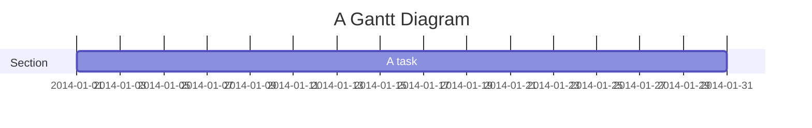

# Schwifty Markdown

[](https://www.npmjs.org/package/schwifty-markdown)
[](https://nodejs.org)
[](https://github.com/aduh95/schwifty-markdown/blob/master/LICENCE)

This library allows you to generate Markdown files to HTML in your browser.

### Features

- Renders markdown files to HTML using Github CSS.
- Indexes your figures.
- Generates a table of contents for your Markdown file if you add the following
  tag:

  ```html
  <nav id="toc" data-label="Table of contents"></nav>
  ```

- Generates SVG charts in the browser.
- Renders yUML and PlantUML diagrams to SVG on the fly.

### Install locally

> _It's time to get schwifty!_ – Richard Sanchez (C-137)

First, you have to ensure that these dependencies are installed and available on
your path:

- [Node (v13.2.0+)](//nodejs.org)
- [Yarn](//yarnpkg.com) or [npm](//npmjs.com)

> If you want Schwifty to render PlantUML diagrams, you also need:
>
> - [Java](//java.com)
> - _(optional)_ [Graphviz](//graphviz.org) (to generate all PlantUML diagram
>   types)
>
> If you don't want to use those features, you can set an environment variable
> `SCHWIFTY_DISABLE_JAVA` at true or use the `--no-java` flag when running
> `schwifty` to disable the warning on startup.

Then, you need to download the package dependencies using `yarn` (you might need
to use `sudo`):

```sh
yarn global add schwifty-markdown
```

If you want to use `npm`:

```sh
npm -g install schwifty-markdown
```

### Run schwifty

#### Getting started

```sh
schwifty path/to/directory/to/listen
```

Schwifty is going to listen for changes in all the markdown files within the
`path/to/directory/to/listen` and its subdirectories. As soon as you touch a
`.md` file (E.G.: pressing the save button of your editor), your default browser
should open or reload to render your document.

You can also watch only one file if that is more convenient to you:

```sh
schwifty path/to/file/to/render
```

You can get a detailed description of the possible options with some examples
using the `--help` flag:

```sh
schwifty --help
```

#### Browser support

Schwifty Markdown uses HTML5; if your browser supports it, it should work just
fine. At the time of writing, all major browsers\* in their latest version
support Schwifty. If Schwifty detects that your browser doesn't support / has
disabled some features it uses, it will display a warning and try to render your
document the best it can.

> \*Major browsers where Schwifty had been tested: Google Chrome, Microsoft
> Edge, Mozilla Firefox, Safari.
>
> On Firefox, the following flags may need to be activated in `about:config`:
>
> - `network.preload`
> - `dom.allow_scripts_to_close_windows` [optional]

#### Output as PDF

To generate a PDF file, you have to use the print feature of your browser.

You can insert **page break** in your document like this:

```markdown
This goes on the first page

---

This goes on the second one
```

If you have `Chromium 62+` installed (or one of its derivatives, such as
`Google Chrome` or `Chrome Canary`), you can generate a PDF file from the CLI to
automate the process :

```sh
schwifty ./myFile.md --browser=chromium-browser -o ./dist/myOutput.pdf
```

> If you want to render in parallel several files, you must specify a different
> port for each command (with the `--port` flag).

#### Syntax highlighting

You can insert snippet of code in your document:

````markdown
```c
#include <stdio.h>

int main(int argc, char* argv) {
    printf("Hello World!\n);
    return 0;
}
```
````

Schwifty Markdown uses [highlight.js](https://highlightjs.org/) to highlight
your code. You have to specify the language you are using, else it will be
interpreted as plain text.

**N.B.:** Schwifty uses the CDN hosted version of `highlight.js`, which means a
network access is required to perform the syntax highlighting.

#### Automatic Table Of Content

As your document is becoming bigger and bigger, the need to index your headings
and have a table of contents linking to the different parts of the document will
increase. You can have this by using this tag in your markdown file:

```html
<nav id="toc"></nav>
```

**N.B.:** Schwifty indexes only the headings which come after the `<nav>` tag.

**N.B.:** The tag must only appear once in your document.

By default, the TOC is collapsed into a `<summary>` element. You might want to
change its text for i18n. Exemple, for a document written in French:

```html
<nav id="toc" data-label="Table des matières"></nav>
```

Markdown allows you to have up to 6 levels of headings, which allows you to
define sub-part, and sub-sub-part, etc. in your document. However, you might
want the deepest levels not to be included in your TOC. You can specify a
maximum heading level for your TOC by adding an attribute to the tag:

```html
<!-- This will ask Schwifty to ignore headings of level 5 and 6 -->

<nav id="toc" data-deepest-level="4"></nav>
```

#### Figure indexing

By default, Schwifty Markdown indexes all your figures and displays the
incremented counter before the caption of the figure. If you want to change this
behavior, you can add the following code in your document:

```html
<!-- Remove the figure counter -->

<style>
  figcaption::before {
    display: none;
  }
</style>
```

Furthermore, if you want to completely disable the captions below the figures,
use the following:

```html
<!-- Remove all the figure captions -->

<style>
  figcaption {
    display: none;
  }
</style>
```

> You can also provide an external CSS file to your document, see
> [Metadata](#metadata) section.

#### Charts

You can add charts on your document. Schwifty reads CSV, so you can link to your
data and it will render a line chart:

```markdown

```

Your data can be represented this way in the `data.csv` file:

```csv
# Lines starting with `#` will be ignored, you can use them for your comments
# First the labels
Monday,Tuesday,Wednesday,Thursday,Friday
# BTW, you can omit this first line, Schwifty will use a range of integers starting from 1
# Then comes the data
8,5,6,2,3
# You can have several lines of data
5,6,8,4,3
# Empty lines will be ignored, don't be afraid to take your space


5,6,1,2,3
```

If you don't need a separate file to host the graph data, you can inline it:

````markdown


```csv
# No header line, a range will be used
1;4;3
```
````

If you need more customization, you can use a JSON file:

```json
{
  "type": "Line",
  "data": {
    "labels": ["Mon", "Tue", "Wed", "Thu", "Fri"],
    "series": [
      [8, 5, 6, 2, 3],
      [5, 6, 8, 4, 3],
      [5, 6, 1, 2, 3]
    ]
  },
  "options": {}
}
```

There are 3 `type`s supported:

- Line
- Pie
- Bar

In the `data` field, you can either provide:

- a `string`, as a path to a `CSV` data file
- an object that needs to consist of a `labels` array and a `series` (either as
  an array or as a `string` path to a `CSV` data file)

Then, the `options` field ; the list of available options is described on the
[Chartist documentation](//gionkunz.github.io/chartist-js/api-documentation.html).

> You can combine the three methods by having an inline JSON for the
> customization and a CSV file for the data:
>
> ````markdown
> 
>
> ```json
> {
>   "type": "Bar",
>   "data": "./data.csv"
> }
> ```
> ````

_The rendering is done locally using a fork of
[Chartist](https://gionkunz.github.io/chartist-js/)._

#### yUML usage

Schwifty Markdown can render on-the-fly your yUML diagrams, just insert it as an
image, it will render as an SVG.

```markdown

```

> You can also inline them:
>
> ````markdown
> 
>
> ```yuml
> // Your yUML code here
> ```
> ````

The syntax is described on this
[wiki page](https://github.com/jaime-olivares/vscode-yuml/wiki).

_The rendering is done locally using
[yuml2svg](https://github.com/aduh95/vscode-yuml) which relies on
[Viz.js](https://github.com/mdaines/viz.js) (a Javascript port of
[Dot/Graphviz](http://www.graphviz.org/))._

#### PlantUML usage

Schwifty Markdown can render on-the-fly your PlantUML diagrams, just insert it
as an image, it will render as an SVG.

```markdown

```

> You can also inline them:
>
> ````markdown
> 
>
> ```plantuml
> ' Your PlantUML code here
> ```
> ````

The syntax is described on the [PlantUML website](http://PlantUML.com/).

**N.B.:** As PlantUML rendering requires to call a Java dependency, the process
might be slow depending of your machine (about 20 times slower than yUML
rendering on my computer). All the rendering is done locally, you don't need a
network access to work with your diagrams.

**N.B.:** The only supported extension for PlantUML diagrams is `.pu`. If you
think I should add support more file extensions, please raise an issue or submit
a pull request.

**N.B.:** If you use [preprocessing includes](http://plantuml.com/preprocessing)
in your diagrams, you might have trouble with the cache of your navigator. Most
browser won't ask schwifty to re-generate the SVG unless the target file has
changed. You can either empty your cache or modify the target file (adding a new
empty line is enough).

**N.B.:** Some browsers have trouble exporting vector images with shadow, which
is why Schwifty disables them by default. If you use the `--plantuml-config`
option to set a custom config file for PlantUML, you might want to add the line
`skinparam shadowing false`.

#### mermaid usage (experimental)

Schwifty Markdown have a limited support for
[mermaid diagrams](https://mermaidjs.github.io/).

- Network access is required (uses a CDN-hosted version)
- External files not supported

````markdown



````

#### Metadata

You can add YAML metadata at the beginning of your markdown files:

```markdown
---
title: Custom title # By default, Schwifty uses the first heading as title
lang: en
date: 1970-01-01

# This is a YAML comment

application-name: Schwifty
keywords: test,schwifty,cypress
description:
  This file set a lot of metadata which should be inserted into HTML by
  Schwifty.

# Adding JS && CSS files
script:
  - script.js
  - //code.jquery.com/jquery.js
  - ./empty.mjs # should be added as ES module

style:
  - //code.jquery.com/jquery.css
  - myCSS.css
---
```
