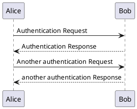
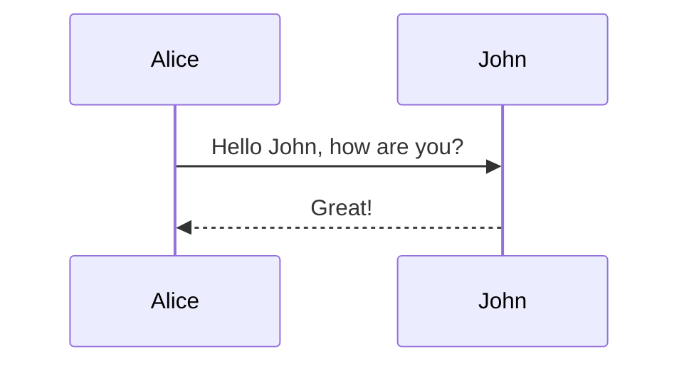

# yUML graph test


```yuml
// {type:sequence}
[:Computer]sendUnsentEmal>[:Server]
[:Computer]newEmail>[:Server]
[:Server]reponse.>[:Computer]
[:Computer]downloadEmail>[:Server]
[:Computer]deleteOldEmail>[:Server]
```






